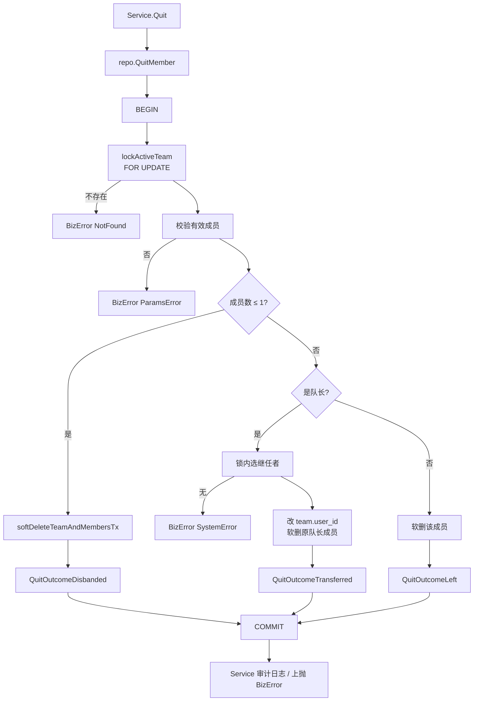
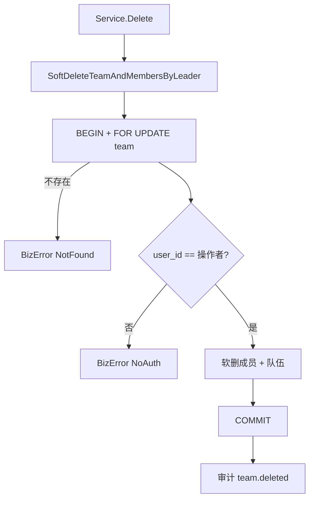

# 队伍模块：事务与数据库锁策略

本文说明 `team` / `user_team` 在**退出、解散、队长移交**等结构变更路径上的事务边界、行锁策略，以及与 **Join 所用 Redis 锁** 的分工。实现主要分布在：

| 文件 | 职责 |
| ---- | ---- |
| `service.go` | 用例入口：`Join`（Redis 锁）、`Quit` / `Delete`（调用持锁仓储、审计日志） |
| `repository.go` | 持久化端口：`QuitMember`、`SoftDeleteTeamAndMembersByLeader` 等 |
| `repo/team_repo.go` | ent 事务、`lockActiveTeam`（`FOR UPDATE`）、成员读写；可预期失败返回 `BizError` |
| `model.go` | `QuitResult` / `QuitOutcome`（退出结果供审计） |
| `ent` + `--feature sql/lock` | 生成 `TeamQuery.ForUpdate()` |

项目级 Redis 锁总览见 [`docs/REDIS_CACHE.md`](../../../docs/REDIS_CACHE.md)。

---

## 1. 设计目标

队伍结构变更需要满足：

1. **最后一人退出**与**队长主动解散**时，队伍与有效成员关系一并软删，状态一致。  
2. **队长退出**时，在仍有其他成员的前提下移交继任者，再移除原队长成员关系；不把队长交给已离队用户。  
3. 并发下避免：双开队长退出重复移交、解散与退出交错导致中间态、对已解散队伍继续改结构。

采用 **「`team` 行作为聚合根加锁」**：结构变更先 `SELECT team … FOR UPDATE`，再在同一事务内读写 `user_team` 并提交。

---

## 2. 核心原则

### 2.1 聚合根行锁

| 对象 | 策略 | 原因 |
| ---- | ---- | ---- |
| **`team` 行** | 事务内 `FOR UPDATE`（`is_delete = 0`） | 互斥单位是「整支队伍的结构」，一行即可表达队级临界区 |
| **`user_team` 行** | 持锁后普通读 / 条件更新，**默认不加** `FOR UPDATE` | 成员集合在父行锁保护下读写即可；避免多行加锁与死锁顺序问题 |

```text
BEGIN
  SELECT * FROM team
   WHERE id = $team_id AND is_delete = 0
   FOR UPDATE;                 -- 队级互斥入口

  -- 读 user_team（人数 / 是否成员 / 成员列表）
  -- 写 user_team / team（软删、改队长）

COMMIT;                        -- 或 ROLLBACK
```

对应代码：`repo.lockActiveTeam` → `tx.Team.Query().Where(...).ForUpdate().Only(ctx)`。

### 2.2 为何不锁每一条 `user_team`

1. **互斥粒度是队**，不是某一条成员边。  
2. **写协议统一**：凡改该队结构的路径先抢 `team` 锁，则并发写无法在持锁事务中途改集合决策。  
3. **死锁风险更低**：固定「只锁 team（或永远先 team）」；若有的路径先锁成员行、有的先锁 team，易交叉死锁。  
4. **开销**：一队人数上限有限，即便锁子表也可行，但通常没有额外收益。

在 Postgres 默认 **Read Committed** 下，对 `user_team` 的普通 `SELECT` 看到的是该语句执行时已提交的数据；正确性依赖 **写路径遵守同一把队锁**，而不是子表行被锁死。

### 2.3 事务与错误

| 层 | 职责 |
| -- | ---- |
| **repo** | 开事务、行锁、写库；可预期业务失败直接 `response.NewBizErrorWithDetail` / `NewBizError`；系统/驱动错误原样返回 |
| **service** | 参数校验、调用仓储、审计日志；`BizError` 一般直接上抛；移交类 `SystemError` 可补 alert 日志 |

本模块不单独维护 `errors.go` 领域哨兵错误，由仓储在判定点构造业务错误，减少 service 二次映射。

### 2.4 事务 Rollback 与命名返回值

持锁写路径统一使用 **命名返回值 `err`** + `defer`：

```go
func (...) (err error) {
    tx, err := r.client.Tx(ctx)
    if err != nil {
        return err
    }
    defer func() {
        if err != nil {
            _ = tx.Rollback()
        }
    }()
    // ...
    return tx.Commit() // Commit 失败时命名 err 非 nil，defer 会 Rollback
}
```

要点：

1. **`return tx.Commit()` / `return BizError`** 在命名返回值下会写入 `err`，defer 能看到。  
2. 若不用命名返回、只写 `return tx.Commit()`，外层 `err` 可能仍是 `nil`，**Commit 失败时 defer 不会 Rollback**。  
3. 内层避免 `x, err := ...` 无必要地遮蔽 `err`；队长移交分支对查询/更新使用 `=` 赋给同一 `err`。  
4. Commit 失败时库侧通常未提交；显式 Rollback 用于释放连接与行锁，不依赖连接池“顺手清理”。

涉及：`CreateTeamWithLeader`、`SoftDeleteTeamAndMembersByLeader`、`QuitMember`。

---

## 3. 数据模型（与并发相关）

| 表 | 关键字段 | 并发相关约定 |
| -- | -------- | ------------ |
| `team` | `id`, `user_id`（队长）, `is_delete` | 结构变更以该行 `FOR UPDATE` 为入口；有效队伍 `is_delete = 0` |
| `user_team` | `user_id`, `team_id`, `is_delete`, `join_time` | 有效成员 `is_delete = 0`；业务查询均需带该条件 |

成员关系的写入（加入）另见 Join 路径；退出 / 解散只做软删（`is_delete = 1`），不物理删行。

---

## 4. 持锁操作一览

| 业务入口 | Service | Repo（持锁） | 锁内主要步骤 |
| -------- | ------- | ------------ | ------------ |
| 退出队伍 | `Quit` | `QuitMember` | 锁 team → 校验成员 → 按人数/是否队长分支 |
| 队长解散 | `Delete` | `SoftDeleteTeamAndMembersByLeader` | 锁 team → 校验 `user_id == 操作者` → 软删成员 + 队伍 |

### 4.1 `QuitMember` 分支

在 **已持有 `team` 行锁** 的同一事务内：

```text
若 非有效成员 → BizError ParamsError「未加入队伍」

若 有效成员数 ≤ 1
  → 软删全部成员 + 软删 team
  → QuitOutcomeDisbanded

若 当前用户是队长（team.user_id）
  → 按 user_team.id 升序选第一位其他有效成员为继任者
  → 无继任者 → BizError SystemError
  → UPDATE team SET user_id = 继任者 WHERE 仍为原队长且未删
  → 软删原队长成员关系
  → QuitOutcomeTransferred

否则（普通成员）
  → 软删该用户成员关系
  → QuitOutcomeLeft
```

继任者选择与写库均在锁内完成，避免「列表快照里的人已离队仍被设为队长」。

### 4.2 `SoftDeleteTeamAndMembersByLeader`

```text
FOR UPDATE team（有效）
若 user_id ≠ leaderID → BizError NoAuth「无访问权限」
软删该队全部有效 user_team + 软删 team
```

权限在锁内校验，避免「读时是队长、写时已被移交」仍解散成功。

### 4.3 辅助函数

| 函数 | 作用 |
| ---- | ---- |
| `lockActiveTeam` | `is_delete = 0` 的 team 行 `FOR UPDATE`；不存在 → BizError NotFound「队伍不存在」 |
| `softDeleteTeamAndMembersTx` | 调用方已持锁：批量软删成员 + 软删队伍 |

---

## 5. 流程示意

### 5.1 退出（含解散 / 移交）



### 5.2 队长解散



---

## 6. 与 Join（Redis 锁）的分工

| 路径 | 互斥手段 | 保护重点 |
| ---- | -------- | -------- |
| **Join** | Redis `yupao:join_team:{teamID}`（TTL 10s） | 同队并发加入：超员、重复加入（应用层校验 + 抢锁） |
| **Quit / Delete / 移交** | DB `team FOR UPDATE` | 退出、解散、队长移交的结构一致性 |

二者 **不是同一把锁**：

- 持 DB 行锁的退出 / 解散，与仅持 Redis 锁的 Join，在数据库层面 **不会自动串行**。  
- 极端交错（例如解散过程中另一请求 Join 写入成员）仍可能存在；若要求全站结构变更与加入完全串行，需让 Join 也进入 **同一套队级互斥**（例如 Join 事务内 `team FOR UPDATE`，或解散/退出也抢同一 Redis key）。

当前取舍：

- 退出 / 解散 / 移交：低频、正确性优先 → **DB 行锁 + 单事务**。  
- 加入：相对更热、已有 Redis 按队互斥 → **暂不强制与 DB 行锁对齐**（已知边界，见 §8）。

创建队伍 `CreateTeamWithLeader` 使用事务保证「建队 + 队长成员」同成同败，**无** `team FOR UPDATE`（创建时行尚不存在）；「最多创建 5 队」等用户侧配额若需严格并发安全，属 user 维策略，不在本文队级行锁范围。

---

## 7. 仓储返回的 BizError

| 场景 | Code | detail（示例） |
| ---- | ---- | -------------- |
| 无有效队伍行（含已解散） | `NotFound` | 队伍不存在 |
| 非有效成员 | `ParamsError` | 未加入队伍 |
| 解散时非当前队长 | `NoAuth` | 无访问权限 |
| 队长退出无继任者 / 移交条件更新未命中 | `SystemError` | （默认系统文案） |

Service 对上述错误直接 `return err`；若 `BizCode == SystemError`（移交失败），补一条 `purpose=alert` 日志。

`QuitResult.Outcome` 用于审计，不直接暴露给 API：

| Outcome | 日志 event（示例） |
| ------- | ------------------ |
| `QuitOutcomeDisbanded` | `team.disbanded` |
| `QuitOutcomeTransferred` | `team.leader_transferred` |
| `QuitOutcomeLeft` | `team.quit` |

---

## 8. 已知边界与演进方向

| 边界 | 说明 |
| ---- | ---- |
| Join 不持 `team` 行锁 | 与 Quit/Delete 的 DB 锁不互斥；完整串行需统一互斥协议 |
| `SoftDeleteMember` 单独调用 | 若绕过 `QuitMember` 且不锁 team，可能与持锁路径交错；业务退出应走 `Quit` |
| 用户「最多 5 队」 | Join 侧校验；跨队并发仍可能竞态（见 service 注释）；非本文 team 行锁职责 |
| `user_team` 唯一约束 | 以当前 `ent/schema` 为准；若上 `(user_id, team_id)` 唯一，可与加入路径配合防重复行 |

演进时可考虑：

1. Join 与结构变更统一为 **事务内 `team FOR UPDATE`**（或全部走同一 Redis 队锁）。  
2. `team.member_count` / `user.joined_team_count` 条件更新，减少 `COUNT` 竞态窗口。  
3. Service 侧对 Quit 增加预检（存在 / 已加入）仅作快失败；**锁内校验仍不可省**。

---

## 9. 扩展与评审清单

新增「会改队伍结构或有效成员集合」的写路径时：

1. 是否在 **同一事务** 内先 `lockActiveTeam`（或等价 `FOR UPDATE`）？  
2. 读人数 / 成员列表 / 队长是否都在 **持锁之后**？  
3. 更新队长时是否带 **条件**（如 `user_id = 原队长` 且 `is_delete = 0`）？  
4. 是否避免 service 层「先查后写」多段无锁调用拼出退出/移交？  
5. 可预期失败是否在判定点返回统一 `BizError`（文案与码）？  
6. 若与 Join 强一致，是否纳入 §6 的统一互斥？

---

## 10. 相关代码索引

| 符号 | 位置 |
| ---- | ---- |
| `lockActiveTeam` | `repo/team_repo.go` |
| `softDeleteTeamAndMembersTx` | `repo/team_repo.go` |
| `QuitMember` | `repo/team_repo.go` |
| `SoftDeleteTeamAndMembersByLeader` | `repo/team_repo.go` |
| `Service.Quit` / `Service.Delete` | `service.go` |
| `Service.Join` + `joinLockKey` | `service.go`（Redis） |
| `ForUpdate` 生成 | `ent/generate.go`（`--feature sql/lock`） |
| `BizError` | `internal/pkg/response` |
