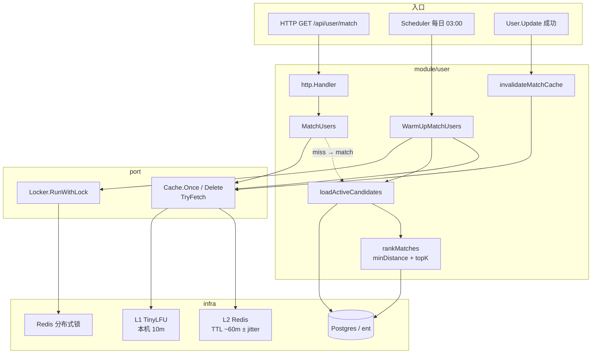
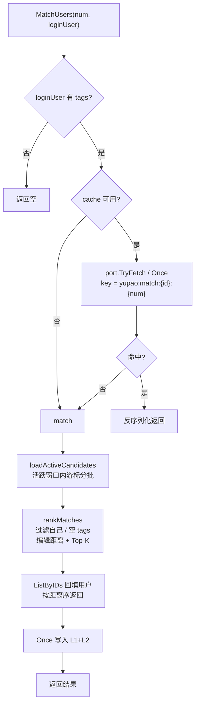
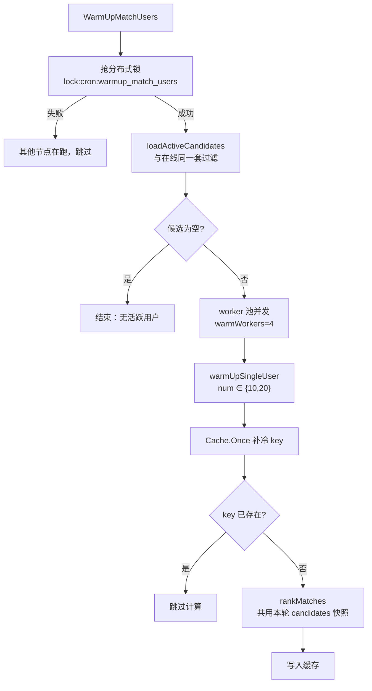
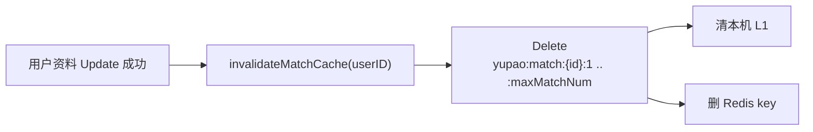

# 用户匹配查询缓存

本文说明 `MatchUsers` 相关缓存策略、候选过滤原则与预热机制。实现主要分布在：

| 文件                      | 职责                                                                      |
| ------------------------- | ------------------------------------------------------------------------- |
| `match.go`                | 在线匹配主调用链：MatchUsers / match / loadActiveCandidates / rankMatches |
| `cache_task.go`           | 定时预热、缓存失效                                                        |
| `distance.go` / `topk.go` | 标签编辑距离与 Top-K                                                      |
| `repo/user_repo.go`       | 活跃候选 SQL 查询                                                         |
| `internal/port`           | Cache / Locker 端口与 TryFetch                                            |
| `internal/infra/cache`    | Redis + 本地 L1 的 Once / Delete 实现                                     |

---

## 0. 架构与主流程

### 0.1 组件关系

在线请求、定时预热、资料更新失效，共用同一套 **候选池定义** 与 **缓存 key 空间**；业务只依赖 `port`，不直接绑 Redis。



代码级调用链（仅三层）：

```text
MatchUsers
  └─ hit  → 返回
  └─ miss → match
              ├─ loadActiveCandidates   // 唯一候选池入口
              └─ rankMatches            // 排序 + ListByIDs

WarmUp
  └─ loadActiveCandidates               // 同一入口
  └─ 对每个用户 Cache.Once → rankMatches(共用 candidates)
```

### 0.2 在线读路径（Cache-Aside）



### 0.3 预热路径（补冷，不强制覆盖）



### 0.4 失效路径



说明：

- **在线 miss 与预热** 都必须经 `loadActiveCandidates`，禁止两套候选集写同一 key。
- **Once** = 补冷 / 防击穿；已有 key 不会被预热覆盖。
- **失效** 只删「被更新用户」自己的推荐结果；TA 出现在别人推荐列表里的缓存依赖 TTL 过期。

---

## 1. 缓存什么

| 项        | 说明                                                                      |
| --------- | ------------------------------------------------------------------------- |
| **Key**   | `yupao:match:{userID}:{num}`                                              |
| **Value** | 为 `userID` 推荐的 `num` 个用户列表（序列化后的 `[]*User`）               |
| **TTL**   | 基准 60 分钟，写入时附带最多约 20% 的随机缩短（jitter），降低同时过期风险 |
| **层级**  | L1 进程内 TinyLFU（容量 1000，本地 TTL 10 分钟）+ L2 Redis                |

同一用户、不同 `num` 使用不同 key（例如 `num=10` 与 `num=20` 互不影响）。

---

## 2. 读路径（Cache-Aside / 读穿写）

```
MatchUsers(num, loginUser)
  ├─ 当前用户无 tags → 直接返回空
  ├─ cache == nil   → match（不算缓存）
  └─ port.TryFetch / Once
       ├─ hit  → 反序列化返回
       └─ miss → match → 写缓存 → 返回
                    ├─ loadActiveCandidates
                    └─ rankMatches
```

要点：

1. **Once 语义**：key 已存在则不执行计算函数；同 key 并发 miss 时只计算一次。
2. **在线与预热同源**：均使用 `loadActiveCandidates` + `rankMatches`，避免「预热写窄结果、在线读到脏数据」。
3. **Once 不强制刷新**：已有 key 不会在预热时被覆盖；预热只补冷 key。
4. **依赖方向**：`user` 只依赖 `port.Cache` / `port.Locker`，不直接依赖 `infra` 实现。

---

## 3. 候选池与过滤原则

在线匹配与预热**共用**候选池定义（`loadActiveCandidates` → `ListActiveMatchCandidates`）。

### 3.1 入库过滤（SQL）

| 条件                                     | 含义                                    |
| ---------------------------------------- | --------------------------------------- |
| `user_status = 0`                        | 正常状态用户                            |
| `is_delete = 0`                          | 未逻辑删除                              |
| `tags != ""`                             | 有标签字段（可参与相似度计算）          |
| `update_time >= now - matchActiveWindow` | 近窗口内有资料更新（当前窗口 **7 天**） |
| `id > afterID` + `ORDER BY id` + `LIMIT` | ID 游标分批，避免一次加载过大           |

### 3.2 内存过滤（算法阶段）

| 条件                  | 含义                                |
| --------------------- | ----------------------------------- |
| 排除 `loginUser` 自身 | 不推荐自己                          |
| 解析后 tags 为空      | 跳过（无法算编辑距离）              |
| 请求方 tags 为空      | `MatchUsers` / 预热单用户均直接跳过 |

### 3.3 相似度

- 使用标签序列的最小编辑距离（`minDistance`）。
- 距离越小越相似；`topKNearest` 取距离最小的 `num` 个 ID。
- 再按 ID 列表顺序 `ListByIDs` 回表完整用户，保持排序稳定。

---

## 4. 写与失效

| 场景               | 行为                                                                     |
| ------------------ | ------------------------------------------------------------------------ |
| 缓存 miss 计算成功 | Once 写入 Redis（及本机 L1），TTL = `matchCacheTTL` ± jitter             |
| 用户 `Update` 成功 | `invalidateMatchCache`：删除该用户 `num = 1..maxMatchNum` 的全部匹配 key |
| 预热任务           | 对活跃候选中的用户，按 `warmUpNums`（默认 10、20）调用 Once **补冷**     |

说明：

- 失效只删「被更新用户」自己的推荐结果，不扫全站「包含该用户作为推荐项」的缓存；后者依赖 TTL 自然过期。
- 多实例下 L1 仅本机删除，其他节点可能短暂读到本地旧值（最长约本地 TTL），可接受则保持现状。

---

## 5. 预热策略

| 项       | 说明                                                                                                   |
| -------- | ------------------------------------------------------------------------------------------------------ |
| 触发     | 定时任务（入口默认每天 03:00）                                                                         |
| 互斥     | Redis 分布式锁 `lock:cron:warmup_match_users`（TTL 10 分钟）+ 进程内 mutex + cron `SkipIfStillRunning` |
| 候选     | 与在线相同的 `loadActiveCandidates`                                                                    |
| 并发     | 固定 worker 池（默认 4）                                                                               |
| 覆盖 num | 仅 `10`、`20`；其他 1–20 仍走在线懒加载                                                                |
| 取消     | 尊重 `ctx` 取消/超时，任务可提前结束                                                                   |

预热与在线写入**同一 key 空间**，因此候选过滤与算法必须一致（本仓库方案 B）。

---

## 6. 关键参数一览

| 常量                | 默认   | 用途                                 |
| ------------------- | ------ | ------------------------------------ |
| `matchCacheTTL`     | 60m    | 匹配结果缓存 TTL                     |
| `matchActiveWindow` | 7d     | 活跃候选时间窗                       |
| `maxMatchNum`       | 20     | 接口最大 num / 失效时删除的 key 范围 |
| `warmBatchSize`     | 200    | 游标分批大小                         |
| `warmWorkers`       | 4      | 预热并发度                           |
| `warmUpNums`        | 10, 20 | 预热覆盖的 num                       |
| `lockTTL`           | 10m    | 预热分布式锁 TTL                     |

修改窗口或过滤条件时，**必须**保证在线 `match` 与预热仍走同一 `loadActiveCandidates`，否则会再次出现缓存语义分裂。

---

## 6.1 相关日志（便于排障）

实现使用 `internal/pkg/logger`（`module=user`）。常见 event：

| event | purpose | 级别 | 说明 |
|-------|---------|------|------|
| `cache.match.miss` | cache | Debug | 在线匹配缓存未命中 |
| `cache.match.invalidate_error` | cache | Warn | Update 后删 match key 失败 |
| `warmup.lock_acquired` / `warmup.skip_lock` | job | Info | 预热抢锁成功 / 他节点占用跳过 |
| `warmup.start` / `warmup.done` / `warmup.cancelled` | job | Info/Warn | 预热起止与取消 |
| `warmup.load_error` / `warmup.key_error` / `warmup.error` | job（严重可 alert） | Error | 候选加载 / 单 key / 系统失败 |

总约定见 [pkg/logger/README.md](../../pkg/logger/README.md)；Redis 总览见 [docs/REDIS_CACHE.md](../../../docs/REDIS_CACHE.md)。

---

## 7. 设计约束（易踩坑）

1. **不要**在预热里用子集候选、在线 miss 用全量用户（或反过来）却写同一 key。
2. **不要**把 `update_time` 窗口设得过窄又只在凌晨跑预热——候选会接近空集。
3. `Once` 适合「补冷 / 防击穿」；若要做「每日强制刷新结果」，需先 Delete 或提供强制 Set。
4. 匹配复杂度随候选规模近似 \(O(N \cdot L)\)（\(N\) 候选数，\(L\) 标签编辑距离代价）；窗口与分批是控规模的主要旋钮。
